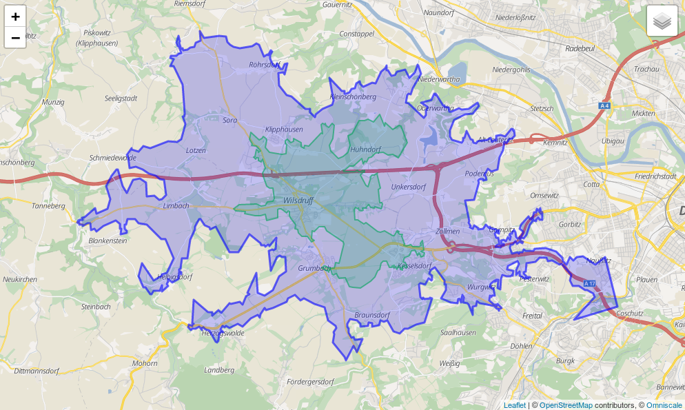

# GraphHopper Routing Engine


GraphHopper is a fast and memory-efficient routing engine released under Apache License 2.0.
It can be used as a Java library or standalone web server to calculate the distance, time,
turn-by-turn instructions and many road attributes for a route between two or more points.
Beyond this "A-to-B" routing it supports ["snap to road"](README.md#Map-Matching),
[Isochrone calculation](README.md#Analysis), [mobile navigation](README.md#mobile-apps) and
[more](README.md#Features). GraphHopper uses OpenStreetMap and GTFS data by default and it
can import [other data sources too](README.md#OpenStreetMap-Support).

# Community

We have an open community and welcome everyone. Let us know your problems, use cases or just [say hello](https://discuss.graphhopper.com/).
Please see our [community guidelines](https://graphhopper.com/agreements/cccoc.html).

## Questions

All questions go to our [forum](https://discuss.graphhopper.com/) where we also have subsections specially for developers, mobile usage, and [our map matching component](./map-matching).
You can also search [Stackoverflow](http://stackoverflow.com/questions/tagged/graphhopper) for answers.

## Contribute

Read through our [contributing guide](CONTRIBUTING.md) for information on topics
like finding and fixing bugs and improving our documentation or translations!
We also have [good first issues](https://github.com/graphhopper/graphhopper/issues?q=is%3Aopen+is%3Aissue+label%3A%22good+first+issue%22)
to get started with contribution.

## Get Started

To get started you can try [GraphHopper Maps](README.md#graphhopper-maps), read through [our documentation](./docs/index.md) and install GraphHopper including the Maps UI locally.

* 11.x: [documentation](https://github.com/graphhopper/graphhopper/blob/11.x/docs/index.md)
  , [web service jar](https://repo1.maven.org/maven2/com/graphhopper/graphhopper-web/11.0/graphhopper-web-11.0.jar)
  , [announcement](https://www.graphhopper.com/blog/2025/10/14/graphhopper-routing-engine-11-0-released/)
* unstable master: [documentation](https://github.com/graphhopper/graphhopper/blob/master/docs/index.md)

See the [changelog file](./CHANGELOG.md) for Java API Changes.

<details><summary>Click to see older releases</summary>

* 10.x: [documentation](https://github.com/graphhopper/graphhopper/blob/10.x/docs/index.md)
  , [web service jar](https://repo1.maven.org/maven2/com/graphhopper/graphhopper-web/10.0/graphhopper-web-10.0.jar)
  , [announcement](https://www.graphhopper.com/blog/2024/11/05/graphhopper-routing-engine-10-0-released/)
* 9.x: [documentation](https://github.com/graphhopper/graphhopper/blob/9.x/docs/index.md)
  , [web service jar](https://repo1.maven.org/maven2/com/graphhopper/graphhopper-web/9.1/graphhopper-web-9.1.jar)
  , [announcement](https://www.graphhopper.com/blog/2024/04/23/graphhopper-routing-engine-9-0-released)
* 8.x: [documentation](https://github.com/graphhopper/graphhopper/blob/8.x/docs/index.md)
  , [web service jar](https://repo1.maven.org/maven2/com/graphhopper/graphhopper-web/8.0/graphhopper-web-8.0.jar)
  , [announcement](https://www.graphhopper.com/blog/2023/10/18/graphhopper-routing-engine-8-0-released/)
* 7.x: [documentation](https://github.com/graphhopper/graphhopper/blob/7.x/docs/index.md)
  , [web service jar](https://repo1.maven.org/maven2/com/graphhopper/graphhopper-web/7.0/graphhopper-web-7.0.jar)
  , [announcement](https://www.graphhopper.com/blog/2023/03/14/graphhopper-routing-engine-7-0-released/)
* 6.x: [documentation](https://github.com/graphhopper/graphhopper/blob/6.x/docs/index.md)
  , [web service jar](https://repo1.maven.org/maven2/com/graphhopper/graphhopper-web/6.2/graphhopper-web-6.2.jar)
  , [announcement](https://www.graphhopper.com/blog/2022/09/19/graphhopper-routing-engine-6-0-released/)
* 5.x: [documentation](https://github.com/graphhopper/graphhopper/blob/5.x/docs/index.md)
  , [web service jar](https://github.com/graphhopper/graphhopper/releases/download/5.3/graphhopper-web-5.3.jar)
  , [announcement](https://www.graphhopper.com/blog/2022/03/23/graphhopper-routing-engine-5-0-released/)
* 4.x: [documentation](https://github.com/graphhopper/graphhopper/blob/4.x/docs/index.md)
  , [web service jar](https://github.com/graphhopper/graphhopper/releases/download/4.0/graphhopper-web-4.0.jar)
  , [announcement](https://www.graphhopper.com/blog/2021/09/29/graphhopper-routing-engine-4-0-released/)
* 3.x: [documentation](https://github.com/graphhopper/graphhopper/blob/3.x/docs/index.md)
  , [web service jar](https://github.com/graphhopper/graphhopper/releases/download/3.2/graphhopper-web-3.2.jar)
  , [announcement](https://www.graphhopper.com/blog/2021/05/18/graphhopper-routing-engine-3-0-released/)
* 2.x: [documentation](https://github.com/graphhopper/graphhopper/blob/2.x/docs/index.md)
  , [web service jar](https://github.com/graphhopper/graphhopper/releases/download/2.4/graphhopper-web-2.4.jar)
  , [announcement](https://www.graphhopper.com/blog/2020/09/30/graphhopper-routing-engine-2-0-released/)
* 1.0: [documentation](https://github.com/graphhopper/graphhopper/blob/1.0/docs/index.md)
  , [web service jar](https://github.com/graphhopper/graphhopper/releases/download/1.0/graphhopper-web-1.0.jar)
  , [Android APK](https://github.com/graphhopper/graphhopper/releases/download/1.0/graphhopper-android-1.0.apk)
  , [announcement](https://www.graphhopper.com/blog/2020/05/25/graphhopper-routing-engine-1-0-released/)
* 0.13.0: [documentation](https://github.com/graphhopper/graphhopper/blob/0.13/docs/index.md)
  , [web service jar](https://github.com/graphhopper/graphhopper/releases/download/0.13.0/graphhopper-web-0.13.0.jar)
  , [Android APK](https://github.com/graphhopper/graphhopper/releases/download/0.13.0/graphhopper-android-0.13.0.apk)
  , [announcement](https://www.graphhopper.com/blog/2019/09/18/graphhopper-routing-engine-0-13-released/)
* 0.12.0: [documentation](https://github.com/graphhopper/graphhopper/blob/0.12/docs/index.md)
  , [web service jar](https://github.com/graphhopper/graphhopper/releases/download/0.12.0/graphhopper-web-0.12.0.jar)
  , [Android APK](https://github.com/graphhopper/graphhopper/releases/download/0.12.0/graphhopper-android-0.12.0.apk)
  , [announcement](https://www.graphhopper.com/blog/2019/03/26/graphhopper-routing-engine-0-12-released/)
* 0.11.0: [documentation](https://github.com/graphhopper/graphhopper/blob/0.11/docs/index.md)
  , [web service jar](https://github.com/graphhopper/graphhopper/releases/download/0.11.0/graphhopper-web-0.11.0.jar)
  , [Android APK](https://github.com/graphhopper/graphhopper/releases/download/0.11.0/graphhopper-android-0.11.0.apk)
  , [announcement](https://www.graphhopper.com/blog/2018/09/17/graphhopper-routing-engine-0-11-release-open-sourcing-the-isochrone-module/)
* 0.10.0: [documentation](https://github.com/graphhopper/graphhopper/blob/0.10/docs/index.md)
  , [web service zip](https://github.com/graphhopper/graphhopper/releases/download/0.10.3/graphhopper-web-0.10.3-bin.zip)
  , [Android APK](https://github.com/graphhopper/graphhopper/releases/download/0.10.3/graphhopper-android-0.10.3.apk)
  , [announcement](https://www.graphhopper.com/blog/2018/03/08/graphhopper-routing-engine-0-10-released/)
* 0.9.0: [documentation](https://github.com/graphhopper/graphhopper/blob/0.9/docs/index.md)
  , [web service zip](https://github.com/graphhopper/graphhopper/releases/download/0.9.0/graphhopper-web-0.9.0-bin.zip)
  , [Android APK](https://github.com/graphhopper/graphhopper/releases/download/0.9.0/graphhopper-android-0.9.0.apk)
  , [announcement](https://www.graphhopper.com/blog/2017/05/31/graphhopper-routing-engine-0-9-released/)
* 0.8.2: [documentation](https://github.com/graphhopper/graphhopper/blob/0.8/docs/index.md)
  , [web service zip](https://github.com/graphhopper/graphhopper/releases/download/0.8.2/graphhopper-web-0.8.2-bin.zip)
  , [Android APK](https://github.com/graphhopper/graphhopper/releases/download/0.8.2/graphhopper-android-0.8.2.apk)
  , [announcement](https://www.graphhopper.com/blog/2016/10/18/graphhopper-routing-engine-0-8-released/)
* 0.7.0: [documentation](https://github.com/graphhopper/graphhopper/blob/0.7/docs/index.md)
  , [web service zip](https://github.com/graphhopper/graphhopper/releases/download/0.7.0/graphhopper-web-0.7.0-bin.zip)
  , [Android APK](https://github.com/graphhopper/graphhopper/releases/download/0.7.0/graphhopper-android-0.7.0.apk)
  , [announcement](https://www.graphhopper.com/blog/2016/06/15/graphhopper-routing-engine-0-7-released/)
</details>

## Installation

To install the [GraphHopper Maps](https://graphhopper.com/maps/) UI and the web service locally you [need a JVM](https://adoptium.net) (>= Java 17) and do:

```bash
wget https://repo1.maven.org/maven2/com/graphhopper/graphhopper-web/11.0/graphhopper-web-11.0.jar \
  https://raw.githubusercontent.com/graphhopper/graphhopper/11.x/config-example.yml \
  http://download.geofabrik.de/europe/germany/berlin-latest.osm.pbf
java -D"dw.graphhopper.datareader.file=berlin-latest.osm.pbf" -jar graphhopper*.jar server config-example.yml
```

After a while you see a log message with 'Server - Started', then go to http://localhost:8989/ and
you'll see a map of Berlin. You should be able to right click on the map to create a route.

See the [documentation](./docs/index.md) that contains e.g. [the elevation guide](./docs/core/elevation.md) and the [deployment guide](./docs/core/deploy.md).

### Docker

The Docker images created by the community from the `master` branch can be found [here](https://hub.docker.com/r/israelhikingmap/graphhopper)
(currently daily). See the [Dockerfile](https://github.com/IsraelHikingMap/graphhopper-docker-image-push) for more details.

## GraphHopper Maps

The GraphHopper routing server uses GraphHopper Maps as web interface, which is also [open source](https://github.com/graphhopper/graphhopper-maps).

To see GraphHopper Maps in action go to [graphhopper.com/maps/](https://graphhopper.com/maps/),
which is an instance of GraphHopper Maps and available for free, via encrypted connections and from German servers - for a nice and private route planning experience!

[](https://graphhopper.com/maps)

## GraphHopper Directions API

The GraphHopper Directions API is [our](https://www.graphhopper.com/) commercial offering that provides
[multiple APIs](https://docs.graphhopper.com) based on this open source routing engine: the Routing API, the Matrix API, the Isochrone API and the Map Matching API.

It also provides the Route Optimization API, which is based on our open source [jsprit project](http://jsprit.github.io/) and uses the fast Matrix API behind the scenes.

The address search is based on the open source [photon project](https://github.com/komoot/photon), which is supported by GraphHopper GmbH.

## Public Transit

[Get started](./reader-gtfs/README.md#quick-start)

[](./reader-gtfs/README.md#quick-start)

## Mobile Apps

### Online

There is a [web service](./navigation) that can be consumed by [our navigation Android client](https://github.com/graphhopper/graphhopper-navigation-example).

[](https://github.com/graphhopper/graphhopper-navigation-example)

### Offline

Offline routing is [no longer officially supported](https://github.com/graphhopper/graphhopper/issues/1940)
but should still work as Android supports most of Java. See [version 1.0](https://github.com/graphhopper/graphhopper/blob/1.0/docs/android/index.md)
with the Android demo and also see [this pull request](http://github.com/graphhopper/graphhopper-ios) of the iOS fork including a demo for iOS.

[](./android/README.md)

## Analysis

Use isochrones to calculate and visualize the reachable area for a certain travel mode.

You can try the debug user interface at http://localhost:8989/maps/isochrone/ to see the `/isochrone` and `/spt` endpoint in action.

### [Isochrone Web API](./docs/web/api-doc.md#isochrone)

[](./docs/web/api-doc.md#isochrone)

### [Shortest Path Tree API](//www.graphhopper.com/blog/2018/07/04/high-precision-reachability/)

[](https://www.graphhopper.com/blog/2018/07/04/high-precision-reachability/)

### [Map Matching](./map-matching)

There is the map matching subproject to snap GPX traces to the road.

[](./map-matching)


# Technical Overview

GraphHopper supports several routing algorithms, such as 
<a href="https://en.wikipedia.org/wiki/Dijkstra%27s_algorithm">Dijkstra</a> and 
<a href="https://en.wikipedia.org/wiki/A*_search_algorithm">A</a>`*` and its bidirectional variants. 
Furthermore, it allows you to use 
<a href="https://en.wikipedia.org/wiki/Contraction_hierarchies">Contraction Hierarchies</a> (CH) 
very easily. We call this **speed mode**; without this CH preparation, we call it **flexible mode**.

The speed mode comes with very fast and lightweight (less RAM) responses and it does not use heuristics. 
However, only predefined vehicle profiles are possible and this additional CH preparation is time and resource consuming.

Then there is the **hybrid mode** which also requires more time and memory for the preparation,
but it is much more flexible regarding changing properties per request or e.g. integrating traffic data. 
Furthermore, this hybrid mode is slower than the speed mode, but it is an 
order of magnitude faster than the flexible mode and uses less RAM for one request.

If the preparations exist you can switch between all modes at request time.

Read more about the technical details [here](./docs/core/technical.md).

## License

We chose the Apache License to make it easy for you to embed GraphHopper in your products, even closed source.
We suggest that you contribute back your changes, as GraphHopper evolves fast.

## OpenStreetMap Support

OpenStreetMap is directly supported by GraphHopper. Without the amazing data from
OpenStreetMap, GraphHopper wouldn't be possible at all. 
Other map data will need a custom import procedure, see e.g. <a href="https://github.com/graphhopper/graphhopper/issues/277">Ordnance Survey</a>,
<a href="https://github.com/graphhopper/graphhopper-reader-shp">Shapefile like ESRI</a> or <a href="https://github.com/OPTITOOL/morituri">Navteq</a>.

## Written in Java

GraphHopper is written in Java and officially runs on Linux, Mac OS X and Windows.

### Maven

Embed GraphHopper with OpenStreetMap support into your Java application via the following snippet:

```xml
<dependency>
    <groupId>com.graphhopper</groupId>
    <artifactId>graphhopper-core</artifactId>
    <version>[LATEST-VERSION]</version>
</dependency>
```

See [our example application](./example/src/main/java/com/graphhopper/example/RoutingExample.java) to get started fast.

## Customizable

You can customize GraphHopper with Java knowledge (with a high and low level API) and also without Java knowledge using the [custom models](./docs/core/custom-models.md).

### Web API

With the web module, we provide code to query GraphHopper over HTTP and decrease bandwidth usage as much as possible.
For that we use an efficient polyline encoding, the Ramer–Douglas–Peucker algorithm, and a simple 
GZIP servlet filter.                 

On the client side, we provide a [Java](./client-hc) and [JavaScript](https://github.com/graphhopper/directions-api-js-client)
client.

### Desktop

GraphHopper also runs on the Desktop in a Java application without internet access. For debugging
purposes GraphHopper can produce vector tiles, i.e. a visualization of the road network in the
browser (see #1572). Also a more low level Swing-based UI is provided via MiniGraphUI in the
tools module, see some visualizations done with it [here](https://graphhopper.com/blog/2016/01/19/alternative-roads-to-rome/).
A fast and production-ready map visualization for the Desktop can be implemented via [mapsforge](https://github.com/mapsforge/mapsforge) or [mapsforge vtm](https://github.com/mapsforge/vtm).

# Features

 * Works out of the box with OpenStreetMap (osm/xml and pbf) and can be adapted to custom data
 * OpenStreetMap integration: stores and considers road type, speed limit, the surface, barriers, access restrictions, ferries, conditional access restrictions and more
 * GraphHopper is fast. And with the so called "Contraction Hierarchies" it can be even faster (enabled by default).
 * Memory efficient data structures, algorithms and [the low and high level API](./docs/core/low-level-api.md) is tuned towards ease of use and efficiency
 * Pre-built routing profiles: car, bike, racing bike, mountain bike, foot, hike, truck, bus, motorcycle, ...
 * [Customization of these profiles](./docs/core/profiles.md#custom-profiles) are possible. Read about it [here](https://www.graphhopper.com/blog/2020/05/31/examples-for-customizable-routing/).
 * Provides a powerful [web API](./docs/web/api-doc.md) that exposes the data from OpenStreetMap and allows customizing the vehicle profiles per request. With JavaScript and Java clients.
 * Provides [map matching](./map-matching) i.e. "snap to road".
 * Supports time-dependent public transit routing and reading [GTFS](./reader-gtfs/README.md).
 * Offers turn instructions in more than 45 languages. Contribute or improve [here](./docs/core/translations.md).
 * Displays and takes into account [elevation data](./docs/core/elevation.md).
 * Supports [alternative routes](https://discuss.graphhopper.com/t/alternative-routes/424).
 * Supports [turn costs and restrictions](./docs/core/turn-restrictions.md).
 * Offers country-specific routing via country rules.
 * Allows customizing routing behavior using custom areas.
 * The core uses only a few dependencies (hppc, jts, janino and slf4j).
 * Scales from small indoor-sized to world-wide-sized graphs.
 * Finds nearest point on street e.g. to get elevation or 'snap to road' or being used as spatial index (see [#1485](https://github.com/graphhopper/graphhopper/pull/1485)).
 * Calculates isochrones and [shortest path trees](https://github.com/graphhopper/graphhopper/pull/1577).
 * Shows the whole road network in the browser for debugging purposes ("vector tile support"), see [#1572](https://github.com/graphhopper/graphhopper/pull/1572).
 * Shows so called "path details" along a route like road_class or max_speed, see [#1142](https://github.com/graphhopper/graphhopper/pull/1142) or the web documentation.
 * Written in Java and simple to start for developers via Maven.
