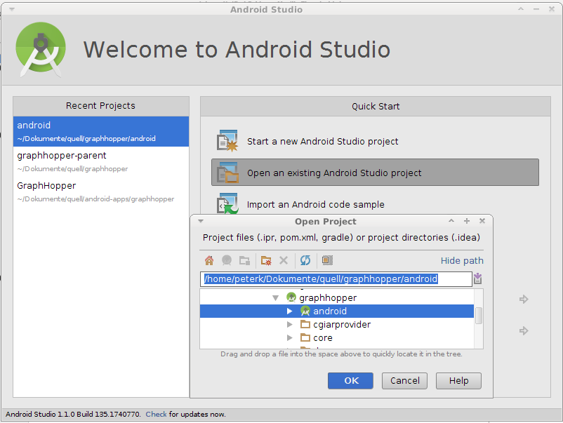
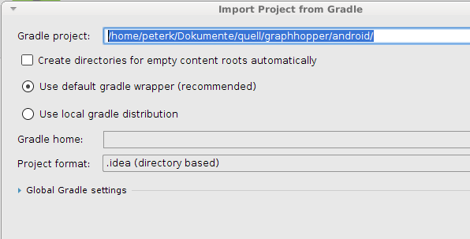

# Open Demo App with Android Studio

Get the [GraphHopper sources and demo](./index.md) before you proceed.

## Setup

[Download](http://developer.android.com/sdk/index.html) and start android studio. 

Open existing Android studio project and then open 'graphhopper/android' not the parent 'graphhopper'

Import project from Gradle, but make sure the 'Gradle project' points to graphhopper/android

## Start Demo

 1. Connect your device in development mode (USB debugging)
 2. Then hit SHIFT+F10 or click Run->Run 'app' in the menu
