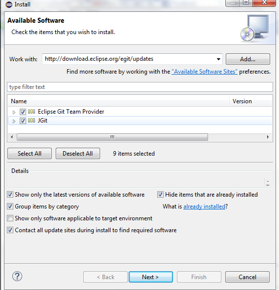

Getting started with GraphHopper in Eclipse
=========
This manual covers step by step instructions on setting up a development and run environment for GraphHopper (web App only) using Eclipse. The instructions and tools used are platform independent and should be applicable for windows, Linux and Mac operating systems. 
Instructions for Android branch will be provided in future.

This document covers configuring Eclipse for cloning and importing GraphHopper repository. 

###1. Download Eclipse

The first step is to download latest version of Eclipse. We recommend that you download the ["Eclipse IDE for Java EE Developers"](http://www.eclipse.org/downloads/) package, instead of the package "for Java developers", as it includes many of the necessary plugins for webapp and API development.  

**Note:** Make sure you grab the correct 32-bit or 64-bit version, depending on your machine and the version of the java installed in your computer. If for example you have a 32 bit java in your x64 machine, you still need to download a 32 bit version of eclipse or you may get an error while trying to open the eclipse.exe file.

**Note:** GraphHopper is set to run with JRE 1.6. This document is written based on setting Eclipse Luna using JRE 1.6.  It may also work with newer versions of JRE, but it has not been tested yet.

###2.	Eclipse Addition al Plugins
Before getting started, you'll need to have a few Eclipse plugins installed to help with development. GraphHopper is versioned using Git and its build process and dependencies are managed by Maven, so certain additional Eclipse components will be needed to tie everything together:

*	A git plugin, a popular choice is [EGit](http://eclipse.org/egit/) which is an "Eclipse team provider" (i.e. version control system plugin) for Git.
*	The Eclipse Maven plugin, [m2eclipse](http://www.eclipse.org/m2e/) which adds Maven support to Eclipse, for editing project models and (automatically) running builds
*	If you want to work on the web interfaces you also need [Web Tools Platform (WTP)](http://www.eclipse.org/webtools/)

**Note**: EGit, WTP, and m2eclipse (as of version 1.0) are hosted by the [Eclipse foundation](http://www.eclipse.org/org/), and they are bundled with some packages of Eclipse.

###3.	Configuring Eclipse with additional plugins
Depending on the Eclipse package you chose, you may need to install one or more of the Eclipse components mentioned previously. You should be able to add all the needed components using either the "Install new software" dialog or the "Eclipse marketplace" component available under Eclipse's help menu. 

####3.1. Using Eclipse Marketplace
The Eclipse Marketplace seems to do a good job with EGit, m2eclipse (also referred to as m2e or "Maven Integration for Eclipse"), and m2e-wtp ("Maven Integration for Eclipse WTP").

You should take the below steps to install your needed components:

* In Eclipse, under _help_ menu, choose _Eclipse Marketplace_. 

* In the opened window, search all _markets/all categories_ and in the _find_ dialoge box type the name of the needed component and click on _Go_ button:

 * Search for “egit” if you need “EGIT” and “EGit – Git Team Provider” should be among first items to appear.
 
 * Search for “maven” or “m2eclipse” if you need “m2eclipse” and “m2eclipse – "Maven Integration for Eclipse” should be among first items to appear. 
   
 * Search for “wtp” if you need “m2e-wtp” and “m2eclipse – "Maven Integration for Eclipse WTP” should be among first items to appear. 

*   Click on _Install_ button. Please note if the component is already installed then there are two other buttons available instead of _Install_. _Update_ if there is an update for the component and _Uninstall_. For example in picture below the user has tried to install EGit using market place, while it has already been included in the package. 

*	The Web Tools components can in fact be installed via the Eclipse Marketplace system, but they will not be found in a search unless you switch to the "EclipseSource Yoxos Marketplace" instead of the "Eclipse marketplace". This is accomplished by clicking on the Orange circle icon next to the purple Eclipse icon at the bottom of the Marketplace dialog box. 

####3.2. Using “Install New Software…” Option
Alternatively, you can use the “Install New Software” option under the _help_ menu to install the needed components. Also if you do happen to miss some web development components try “Install New Software Option” instead of the “Marketplace”. 

Based on needed components take the below steps:
 
*	To install “EGit” in the "Work with:" dialog box, type the EGit server address  at http://download.eclipse.org/egit/updates. Select Eclipse Git Team Provider and JGit form option and click _Next_ and _Finish_ install.
 
  

*	To install “m2e” In the "Work with:" dialog box, type the me2eclipse server address at http://download.eclipse.org/technology/m2e/releases. Select Maven Integration for Eclipse form option and click _Next_ and _Finish_ install. 

 

*	Also if you do happen to miss some web development components,   in the "Work with:" dialog box, type your eclipse server version (e.g. luna) address at http://download.eclipse.org/releases/luna and try  checking the "Web, XML, Java EE, and OSGi Enterprise Development" category, which should include everything you need.  

###4.	Clone and import the GraphHopper Source
At this step you need to clone the GraphHopper GitHub repository locally (get a copy of the GraphHopper source code). Repository cloning can be done using one of the below approaches:

1. EGit Repositories View from within Eclipse

2. Command-line Git tools. Once they are cloned into the local filesystem, the Maven projects in the GraphHopper Git repository can then be imported into Eclipse. 

3. The clone and import operations can be done together using _File -> Import -> Maven -> Import Maven projects from SCM in Eclipse_.
 
**Note:** When the initial clone operation is not done using the clone button in the EGit Repositories View (For example if it is done using command-line Git or "Import Maven projects from SCM"), you  need to inform Eclipse that your project is under Git version control if you want to do pull / push / commit operations from within Eclipse. In any case you can just perform these operations using command-line Git tools.

**Note:**  It is suggested that repositories should be cloned somewhere outside your Eclipse workspace to avoid any misinterpretation or misuse of Git metadata by Eclipse and vice-versa. 

Below we talk more about the first and third approaches of cloning.

####4.1. Approach 1: Clone the GraphHopper repository with the EGit Repositories View

* Switch to the "Git Repository Exploring" perspective in Eclipse by selecting:  _Window -> Open Perspective -> Git Repositories_ .
If you don't see this option under "Open Perspective", choose:  _Window -> Open Perspective -> Other..._ and select "Git Repository Exploring". 

The "Repository Exploring perspective" is preconfigured to contain the Git Repositories view. Alternatively, you can add the Git Repositories view to your main Java perspective: _Window -> Show View -> Other -> Git Repositories_. 

* In the Git Repositories view, click on the "Clone a Git Repository and add clone to this view" button as shown below:

* Enter https://github.com/graphhopper/graphhopper/ for the URI, select "HTTPS" for the protocol. Entering the GitHub username and password is not necessary for cloning the repository. However, if you want to contribute edits back, you'll need to enter your GitHub username and password here too.

* Click _Next_, then select all branches (the “master” branch is probably what need).

* Click _Next_, then select the directory where you want the code to be checked out to. Then click _Finish_. It will take Eclipse a minute or two to download the source to your computer, and then the GraphHopper repository should appear in the "Git Repositories" panel. 

**Note:** An alternate and easy way to this approach is to manually download the GraphHopper zip file directly from GitHub and save it in a local drive in your machine.

**Note:** You still need to import the GraphHopper Maven projects from the local clone of the repository into Eclipse (see Importing existing GraphHopper Maven projects into Eclipse part).

####4.2. Importing existing GraphHopper Maven projects into Eclipse

If you used approach 1 or if you have downloaded the GraphHopper zip file directly form GitHub, you have cloned the GraphHopper repository but the GraphHopper Maven projects are not yet visible in Eclipse. To make the projects visible,cover the below steps:

* Choose the menu option _File -> Import, and then browse to the Maven / Existing Maven Projects element_.

* Browse to the local directory where you cloned the GraphHopper Git repository, and then select all the projects of interest.

* Click _Finish_. It may take a while to initially build all the projects in your workspace. In the background, the Maven plugin is downloading all the project dependencies. If everything works fine you should be able to see each GraphHopper maven module checked out as an individual Eclipse project in your workspace.

####4.3. Approach 2: Clone the GraphHopper repository and import Maven projects all at once
To use this method follow the below steps:
* In Eclipse, choose _File -> Import..._ then choose _Maven / Check out Maven projects from SCM_ in the dialog box, as shown below:

* Click _Next_, then confirm that you are using the Git version control sytstem using the dropdown box next to the label "SCM URL". 

**Note:** The first time you use this option, this "git" option will probably not be available because an m2e/git connector must be installed. Use the blue "m2e marketplace" link in the lower right corner of this dialog box to find and install the m2e Maven SCM handler for Egit,  and the 'git' option should become available in the drop-down box.

* specify the "Target Location" (in this case, the URL of the remote Github repository that you want to clone locally), as shown in below figure. This URL should be https://github.com/graphhopper/graphhopper/

* Click _Next_, then uncheck "Use default workspace location" and specify a directory outside your Eclipse workspace (e.g. ~/git). Your cloned copy of the repository will be placed in a subdirectory of the specified directory, with a rather uninformative name (e.g. ~/git/ maven.1424033308371).

* Click _Finish_, and m2eclipse should both clone the repository and import the Maven projects into your workspace. The Graphhopper top-level maven module, as well as all the other sub-modules, should then appear in your project explorer view. 

####4.4 Making Eclipse aware of your local GraphHopper Git repository

If you use approach 2 or a command-line method, EGit will not be aware of the Git metadata in the new local repository. Therefore operations on the local Git repository will not automatically be possible from within Eclipse.You can choose to do all Git operations on the command line, or make EGit aware of the repository as follows: 

*	Right-click the top-level GraphHopper project in the Project Explorer view and choose _Team -> Share Project_.

*	Specify Git as the repository type and check Use or create repository in parent folder of project on the next page. The .git metadata directory should be found and indicated in the dialog box. At this point you can click the _Finish_ button. An orange cylinder should appear on the GraphHopper folder icon in the "Package Explorer", indicating that it is under version control.

Now, you should be able to open the Git repositories view: _Window -> Show View -> Other -> Git Repositories_, and do push, pull, and commit operations in Eclipse. The advantage of this method over the command line is using EGit's graphical diff window which allows you to review changes and select files to commit.

