Setting up Apache Tomcat Server
=========
After ["Configuring Eclipse to get started with GraphHopper"](https://github.com/graphhopper/graphhopper/blob/master/docs/core/eclipse-setup.md), in this document we cover how to set up Apache Tomcat server and configure it to run GraphHopper.

###1. Install Apache Tomcat Server

To install Tomcat server, open Eclipse and choose a workspace you have already configured to work with GraphHopper. Details for configuring eclipse can be found in this ["document"](https://github.com/graphhopper/graphhopper/blob/master/docs/core/eclipse-setup.md).

 At first you have to make sure that “Dynamic Web Module” has been checked in the project: 

* On Project explorer, right click on _graphhopper-web [graphhopper master]_ and go to "Properties". 

* Choose "Project Facets" and make sure that "Dynamic Web Module" has been selected. If not, select it and then apply the changes.  

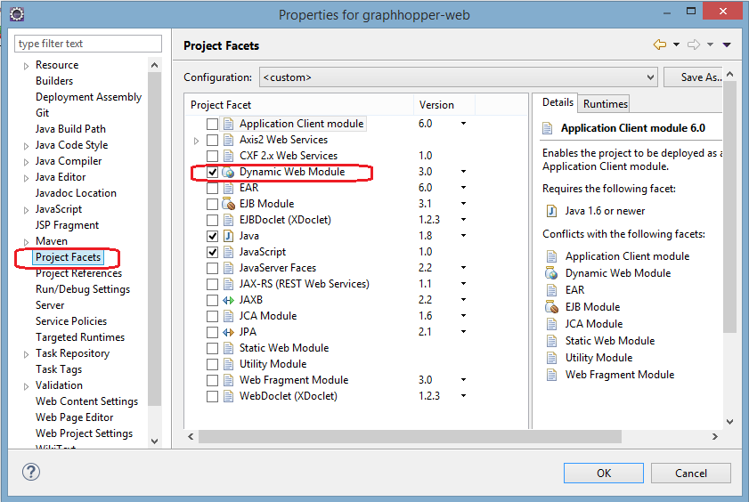

Now you are ready to add or create a new server:

* If you do not see any tab called “Servers” , then go to _window -> Show view_ and then choose "Servers". Please note you may need to choose "Other..." and then "Servers".

* If this is the first time you are creating a server, in the “Servers” area you will see a link as “No servers are available click this link to create a new server”. Click the link.

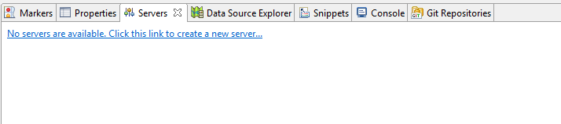

* “Define a New Server” window will be opened, In “Select the server type”. Open “Apache” and choose an appropriate Tomcat version. For this document we chose “Tomcat v8.0 Server”.

* Leave “Server’s host name” as  _localhost_. You can give any name that you want to “Server name”. Then click “Next”. 

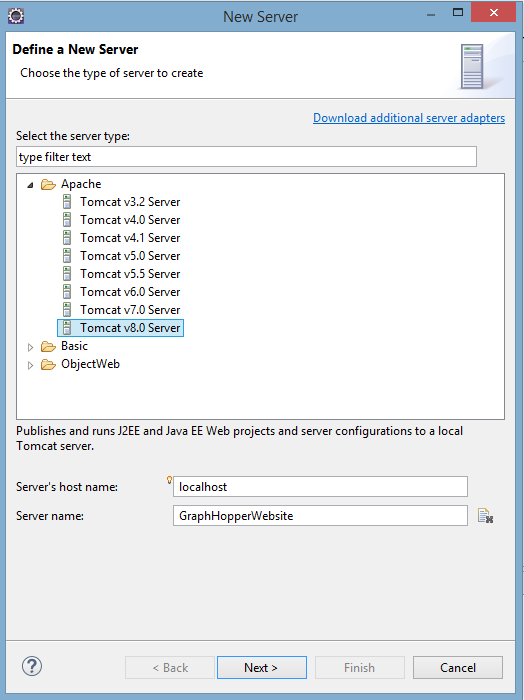

* In “Tomcat Server” page, you need to specify the installation directory for Tomcat. At first in “JRE” part, choose the jre you have installed in your system (e.g.  jre 1.8.0_31).

* If this is the first time you are installing this version of Tomcat you have to click on “Download and Install” to automatically get and install Tomcat, otherwise choose the installation directory for Tomcat as shown in figure. 

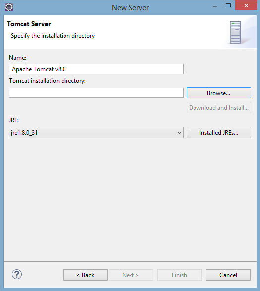

* If this is the first time you are installing a specific version of Tomcat, then the feature license page appears for you. Review the license to decide whether to accept the terms of the agreement. After accepting the terms, choose the installation directory and click "Next".

* In “Add and Remove” page add _graphhopper-web_ from “available:” column to “configured:”. Then click on “Finish”.  Please note that you should wait until the installation completes so that the current Window automatically be closed.

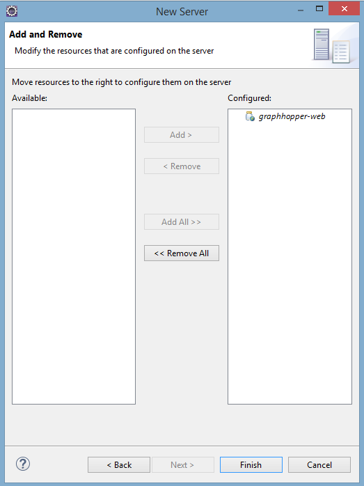

###2.	Basic Configurations
After downloading and installing Tomcat, you need to change some of the default settings: 

* In the "Overview" tab double click the name of the created server. Now in your dashboard you should be able to see the whole overview of the server.

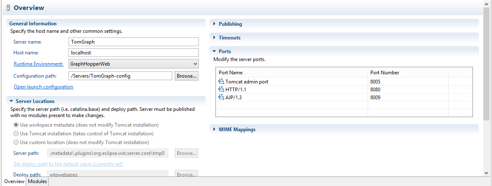

* In “Timeouts” part, change _start_ and _stop times_ appropriately. Please note that when running GraphHopper for the first time, a new graph should be created and it may take some time. Therefore these times (specially the start time) should be increased to give enough time for creating the graph. Here we chose 200 for both times.

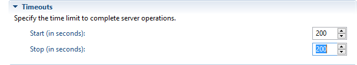

* In The “Ports” part you can choose any port you want for the server to work with. You can also leave the default settings as the below figure.

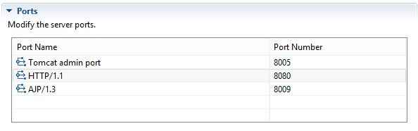

* On "Project explorer", right click on _graphhopper-web [graphhopper master]_ and go to “Build Path” -->”Configure build path” --> “Deployment Assembly”. 
* Make sure in the “Web Deployment Assembly” "src/main/webapp" is added as below figure.

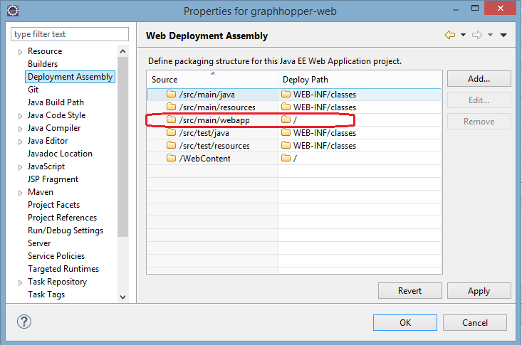

* If not added,select "Add" button.
 * In "Select Directive Type", choose _Folder_ and click "Next".
 * In "Folder" page, click _src_ , then choose _main_  and then select _webapp_. Click "Finish"
 
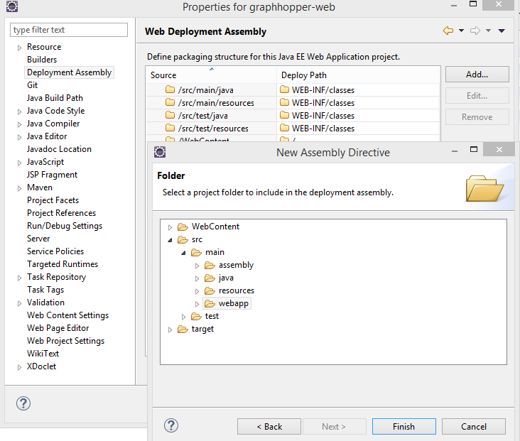
###3.	VM Arguments Configuration
At this step you need to include specific VM arguments corresponds to _map_ and _configuration_ files so that the GraphHopper works without any problem.  

* First of all make sure that you have a configuration folder with _map_ and _configuration_ files. Therefore, create a folder (at any location in your system that you want) and copy the the appropriate _map_ and _configuration_ files to this folder as described below:

 * **Configuration file (config.properties)**: Is a file that contains GraphHopper's configurations. From the GraphHopper git repository, copy the file named “config-example.properties” into the configuration folder you created. Rename the file to “config.properties” ( or any name you want).

 * **Map file (map.osm)**:  Any .osm file can have the map data. The name of the .osm file is defined in the config.properties and by default it is map.osm. You can keep the default name. Get an .osm file and put it in the configuration folder and name it map.osm. Please note you can get an .osm file from ["OpenStreetMap site"](http://www.openstreetmap.org/#map=14/44.5763/-123.2788).
 
 * **Graph folder**: This folder is created automatically based on defining the correct VM argument and upon running GraphHopper. Graph folder is used to keep the created graph by GraphHopper.
 
* Now to add VM arguments, go to “Overview” part and in “General information”, click on “Open launch configuration”.

* In “(x)= Arguments”  tab,  and in “VM arguments” part, add the necessary arguments and their corresponding paths that are not included. You only need to add the below arguments and paths:
 * **1.-Dgraphhopper.config="_Path to config.properties file_"**: config.properties is a file that contains GraphHopper's configurations.
 * **2.-Dgraphhopper.graph.location="_Path to graph folder_"**: In _graph_ folder ( with any optional name) a graph would be created. Upon running GraphHopper a folder ( with the name defined in VM arguments) will be created to keep the graph. So do not worry about manually creating it in the configuration folder.
 * **3.-Dgraphhopper.osmreader.osm="_Path to map.osm file_"**:  *.osm file contains the map data. The name of the .osm file is defined in the config.properties and by default it is map.osm. 

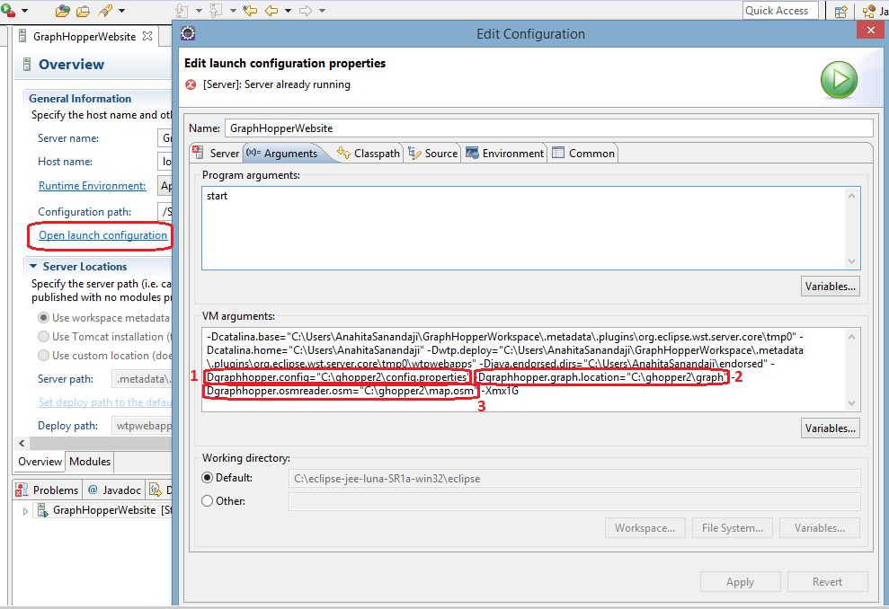

* _-Xmx1G_  is optional and is used to restrict the maximum heap size for Java virtual machine. It should be configured based on the amount of RAM dedicated to run the server. Here we chose 1G. If you have enough RAM on your system, you can increase the number. For example change _-Xmx1G_ to _–Xmx4G_. Please consider that if you choose a wrong amount of RAM, you may face errors. You may also want to not add this optional argument. In this case a predefined heap size will be allocated for Java virtual machine.

###4.  Configuring Web Modules
To complete setting up the Tomcat server go through the below steps: 

* Click the “Modules” tab to go to “Web Modules” .

* Select “graphhopper-web” row. Then click “Edit”.

* Edit the “path” from "_/graphhopper-web_" to "_/_". 

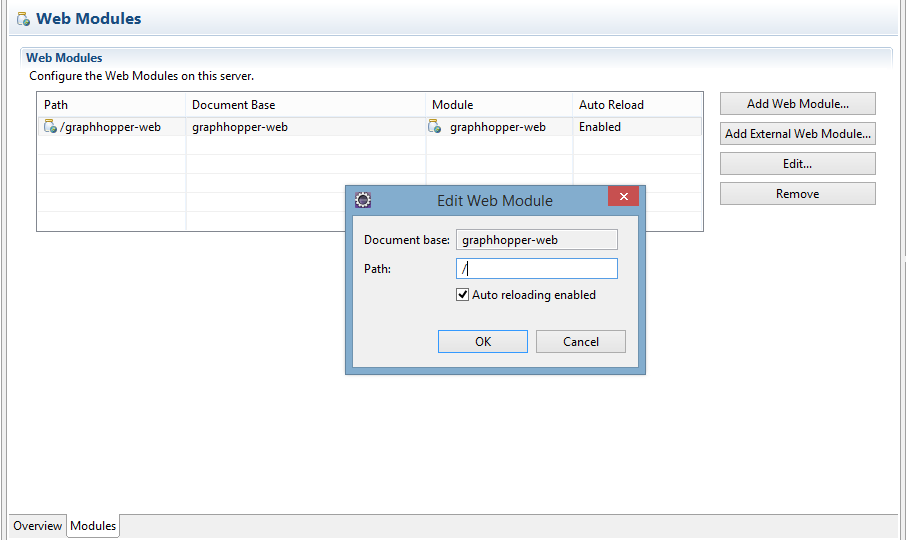

###5. Run Server
 After going through all the previous steps, you are ready to run GraphHopper using Apache Tomcat server in Eclipse. Right click on the name of you server and choose "Start". Or simply click on the green "start" icon.
 If you faced no error and the server started successfully, in your browser type the server address and port. In our example it is : http://localhost:8080/. 
 Congratulations! You have GraphHopper (with basic settings) running and ready for work!
 However it is possible that you face an error as **"NoClassDefFoundError"**. If so, please see the section "6. Configuring Classpath and Resolving Maven Dependencies Problem"
  
 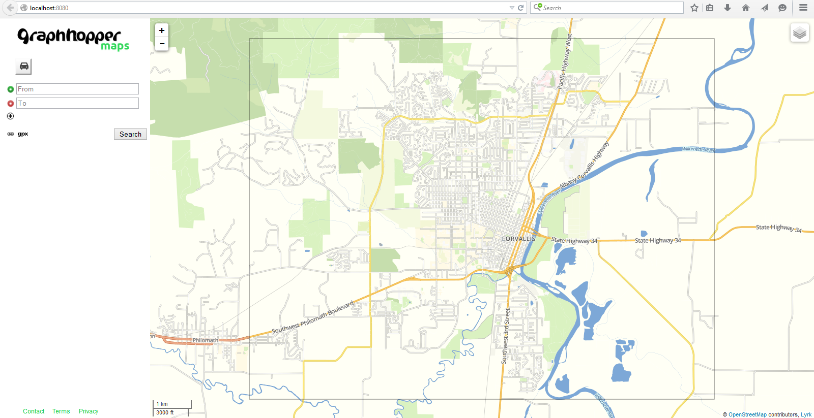
 

###6. Configuring Classpath and Resolving Maven Dependencies Problem
Depending on your Eclipse version or the _m2e_ that you use, _Maven_ may not set _Classpath_ for dependencies properly. Therefore, while running your Tomcat server you may face an error as **"NoClassDefFoundError"**. 
If you faced such an error, at first please check the below websites for the additional plug-ins, instructions on changing pom.xml and solving the similar problem:

* ["Maven not setting classpath for dependencies properly"](http://stackoverflow.com/questions/4687609/maven-not-setting-classpath-for-dependencies-properly)

* ["How to configure Eclipse build path to use Maven dependencies?"](http://stackoverflow.com/questions/2037188/how-to-configure-eclipse-build-path-to-use-maven-dependencies)

However your problem may still not be solved. We could not find any accurate solution for this problem but here is a workaround: 

* In “Configure build path”--> “Java Build Path”, click on “Libraries” tab and choose “Maven Dependencies”. Take a look at all “.jar files". Be ready to find all these .jar files in your system, and to make a copy of them in a folder.

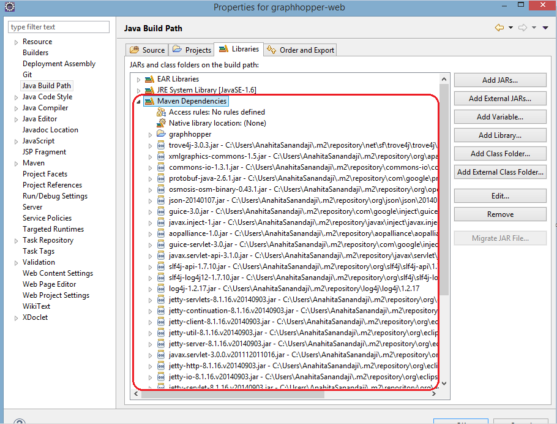

* You have to add all these files to “Classpath” as well. 
 On Project explorer, right click on _graphhopper-web [graphhopper master]_ and go to “Run As” --> “Run configuration…” then choose “Classpass” tab. Under “User Entries” , you see only a few “.jar files”. It should look like the below figure.
 
 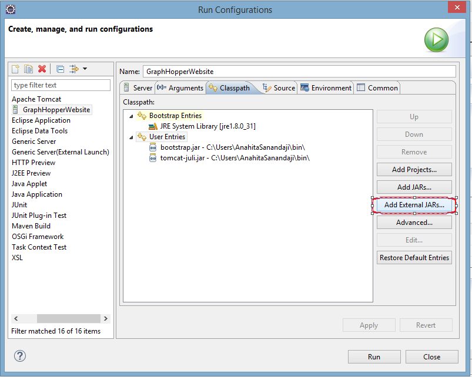
 
* You have to find the location of each .jar file, you saw previously in "Build Path" and add them as an “External JARs” to the Classpath. Since there are lots of files, we suggest that you at first manually copy (not cut!) all the “.jar” files into a folder so that you can use them in future as well.  

* Again go to “User Entries” on “Classpath” and click on “ External JARs…”.  In the “Jar Selection” Window go to the folder you already created with all the .Jar files and select all those files. Now your Classpath should look like below. 

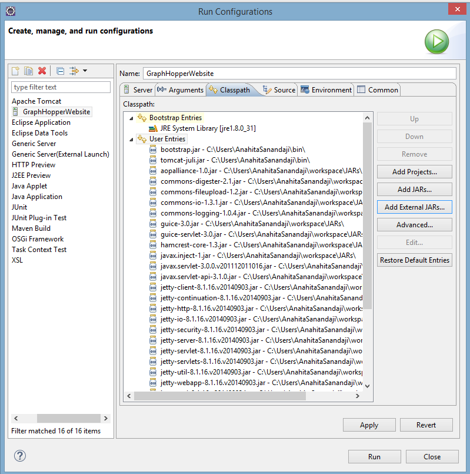

* Finally you also have to add "graphhoper" Project to "Classpath". Click “User Entries” on “Classpath” and select "Add Projects...". Check "graphopper" and click "OK".
 
 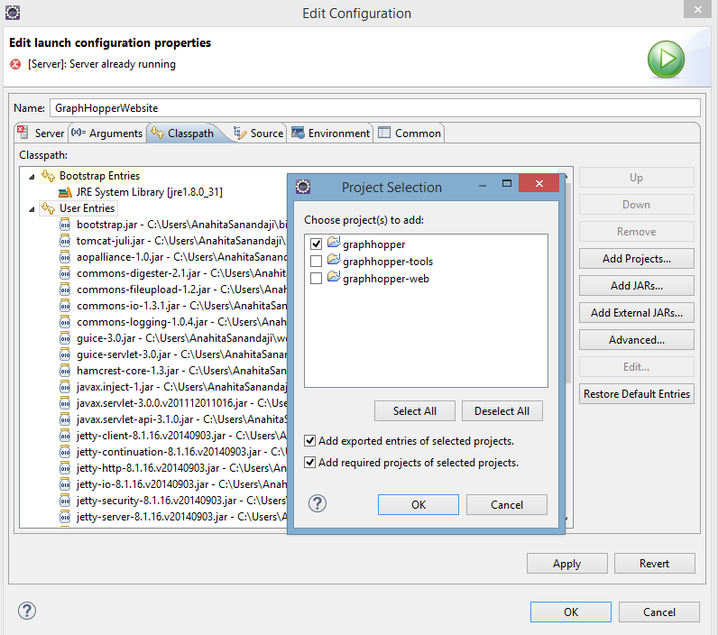
 
The Problem should be resolved with this workaround.
 
 
 

