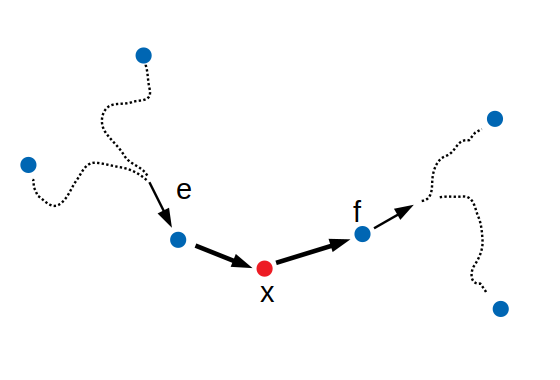

# How do edge-based Contraction Hierarchies work in GraphHopper ?

## General Idea

The idea for edge-based CH is the same as for node-based CH: In a pre-processing phase we want to 'contract' the graph which means that we remove nodes from the graph one by one and every time we do this we have to make sure that all previous shortest path distances remain unchanged. So when we remove a node we might have to add helper edges (shortcuts) between the neighbor nodes of the node we want to remove. We assign a 'rank' (often also called a 'level') to each node as it is contracted (0 for the first node, 1 for the second and so on). Assigning these ranks induces a hierarchical ordering between the nodes which can be exploited to achieve fast queries on the prepared Graph: We only need to settle nodes with higher rank in the forward/backward Dijkstra searches. This is so because, in a CH graph each shortest path between two nodes is an 'up-down' path, i.e. starting from the source the rank of the nodes on the shortest path first only increase until the node with maximum rank is reached and then only decrease. The fwd/bwd searches meet at the node with the highest rank.

## Node Ordering

Just as in node-based CH the order in which we remove the nodes is not important for correctness, but for performance we need heuristics to find a good node ordering. The code for finding this node ordering lives in `PrepareContractionHierarchies` and is the same for node- and edge-based CH. The only difference is how the 'priority' for a node is calculated, which happens in `NodeBasedNodeContractor` or `EdgeBasedNodeContractor`, respectively. As their name suggests, the node contractors are not only responsible to calculate the priority for a node but also to actually contract it (i.e. introduce the necessary shortcuts). However, calculating the priority and contracting a node is very similar, because to calculate the priority we normally need to find all shortcuts (even though we do not add them to the graph in this case). The heuristics used to define the priority of a node are different in the edge-based case than in the node-based case as suggested in the literature [1, 2]. However, there might be potential to improve preparation and query time by using other heuristics or by changing the weights of the different terms entering the priority formula. For edge-based CH we currently use:

* edge-quotient (same idea as edge-difference in node-based CH)
* original-edge-quotient (like edge-quotient, but only taking into account original edge counts)
* hierarchy depth (similar but not the same as in node-based CH)

We use the same formula for the priority as in [2], but with different weights. So far trying different weights has not lead to considerable improvements. An unsolved, potential problem with the current implementation is that towards the end of the contraction the `originalEdgeQuotient` rises drastically and dominates the other terms, which could be an explanation why changing the weights of the terms does not change much and might also lead to too many shortcuts.

## Node Contraction
For edge-based CH the most effort has to be spent on implementing the `EdgeBasedNodeContractor` which is considerably more complex than `NodeBasedNodeContractor`. The first major difference is that for edge-based routing we obviously need an edge-based shortest path algorithm and this means that when we contract a node we not only have to make sure that the shortest path distance between neighbor *nodes* remains invariant, but we have to assert this for neighboring *edges*. So instead of asking "well we just removed node x, can we still go from u to v with the same weight or do we need to add shortcuts" we have to ask "can we still go from edge e to edge f or do we need to add shortcuts". The next obvious question is then which edges e and f we are talking about. It turns out that it is sufficient to look at the original edges that are in/outgoing at the neighboring nodes of the node we want to contract. This is the idea of the 'aggressive' search in [1] compared to the 'simple' search. Importantly, we are only concerned with original edges. We do not have to look at shortcuts adjacent to the neighbor nodes. This saves us from doing many additional witness path searches. Another important thing to recognize is that there can be many edges going from a neighboring node to the node to be contracted. When we start at the original edges incoming to the neighboring node we basically do all the witness searches needed for these edges at once.
  

*Fig.1 In edge-based CH we need to check for shortcuts for all pairs of original edges (here e and f) that are adjacent to neighboring nodes of the node we want to contract (x in the picture). We do not need to perform the check for all pairs of shortcuts adjacent to the neighboring nodes (dashed lines).*

Another very important idea is that to be able to calculate turn costs at a given node we need the edge ids of the incoming and outgoing edge that are part of the turn. This sounds trivial, but what if the incoming or outgoing edge is a shortcut ? Since we use a table lookup to obtain the turn costs the ids of the shortcuts will be of no help. We would have to increase the turncost tables with every shortcut we introduce which would be a lot of redundant information and does not scale on larger maps (this is the way it was done in #912). The solution to this problem is that we store the ids of the first and last original edges with the shortcut. This is also needed for the edge-based shortest path query. When we discover an edge during the edge-based Dijkstra expansion we want to only keep track of the tentative weights for the original edges, not for all shortcut edges.

Also different than in node-based CH is the fact that with edge-based traversal it is possible (and wanted) that we reach a node more than once. This is needed for example when there is a left-turn restriction at a junction and we need to go straight at the junction and then go right a few times until we reach the same junction from another side. However, this also means that there will be loop-shortcuts, which have to be handled specifically in many cases. One important case are loop shortcuts that appear
at the node to be contracted. In this case the shortcuts we introduce when we contract a node do not simply have a first and second 'skipped edge', but there are is in fact a first skipped edge, a second skipped edge and loops at the node to be contracted. To deal with this case we insert multiple nested shortcuts if this happens as suggested in [3] (but this is done differently in [2]). Another consequence of the fact that nodes can be visited multiple times is that when running witness path searches the source- and target-neighbor-node can be the same. See `EdgeBasedNodeContractor` and the related tests for many more details and specific cases with (and without) loops.

Originally we implemented the turn-replacement algorithm described in [2] to obtain the necessary shortcuts, but this introduces a lot more shortcuts than the current implementation, see tests in `EdgeBasedNodeContractorTest`.

## Witness Path Searches

What is also specific for edge-based CH is how we are able to limit witness path searches. What is a witness path search ? When we want to decide if we need a shortcut for a given pair of neighbor edges (or neighbor nodes in node-based CH) we need to run a search that tells us whether or not there is a shortest path between the two that works without the node we want to contract or not. If there is such a path it witnesses (or proofs) that we can safely remove the node without adding a shortcut, because to go the shortest path we would not need it anyway. If there is no such path we have to insert one or multiple shortcuts in exchange of removing the node. Doing these witness searches means that we need to run many local Dijkstra searches and for performance it is very important to limit the search space of these searches. For node-based CH there is an obvious abort criterion, because we know how long it would take us from start to target when we go directly via the node we want to contract, which means we can set a maximum weight for the local searches. However, for edge-based CH this is not the case because of the loops (and possible turn costs/restrictions) at the node we want to contract. Because the witness path searches that are done by `DijkstraOneToMany` for node-based CH are quite different for edge-based CH they are done by a dedicated class `WitnessPathSearcher` in the GraphHopper implementation. To be able to limit the local search spaces in `WitnessPathSearcher` we limit the searches by the number of settled edges. However, for good performance this limit has to be adjusted dynamically during the contraction (see usages of `OnFlyStatisticsCalculator` in `WitnessPathSearcher`). The number of settled edges is determined by the `sigmaFactor` parameter. Small values mean short witness path searches (=fast contraction), but many shortcuts (=slow queries).

Witness path searches in edge-based CH are done by a one-to-many Dijkstra search. However, there is a special twist. To prevent unnecessary shortcuts we have to decide for each witness path that we find if it was using the node to be contracted or not. To do this we assign a special flag to each shortest path entry (isPathToCenter). Note that a path that goes from the source edge to another neighbor node and then via the node to be contracted to the target edge (s->a->x->t) also counts as witness path, because the shortcut will be introduced when we run the witness path searches between a and t. The same is true for the case s->x->b->t. For details see javadocs in `WitnessPathSearcher`. In principle this concept should also reduce unnecessary shortcuts in node-based CH. 

## Shortcut Insertion

In node-based CH the shortcuts for a given node are first collected and then inserted all at once. This means that consecutive witness searches can not use the shortcuts the previous searches have inserted. In edge-based CH the shortcuts are inserted right away at the moment. Another important difference is that in edge-based CH all shortcuts have forward direction only while in node-based internal 'edges' are re-used for both directions. This is another potential performance improvement for edge-based CH that nobody has really tried doing so far. It might be more complicated than in the edge-based case because of loop-shortcuts ?

## CH Query Algorithm

The edge-based CH algorithm is similar to the one in node-based CH in that it is also a bidirectional Dijkstra search that goes along nodes of increasing rank. However, when the fwd/bwd searches connect with each other we still have to take care of the turn costs at the bridge node (where the searches meet). Also it has been found that AStar speeds up the CH query in the edge-based case (in contrast to node-based CH). Probably, because with edge-based traversing there are more entries to explore and the AStar overhead is amortized earlier. So far there is no stall-on-demand implemented for edge-based CH, mostly because the literature suggests that AStar is more promising [3]. It might be worth trying anyway.

## Literature

- [1] *Contraction Hierarchies: Faster and Simpler Hierarchical Routing in Road Networks*, R.Geisberger, 2008
- [2] *Efficient Routing in Road Networks with Turn Costs*, R.Geisberger and C.Vetter, 2011
- [3] *Schnelle Wegsucheverfahren auf digitalen Straßenkarten – Entwicklung, Implementierung und Anwendungsbeispiel bei einem Logistikdienstleister*, Dissertation C. Nowak, 2014
