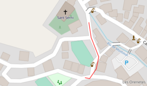
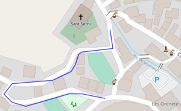
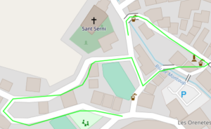
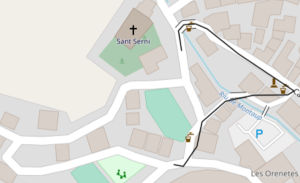

# Heading

The flexible and hybrid modes allow adding a desired heading (north based azimuth between 0 and 360 degree) to any point. Adding a heading makes it more likely that a route starts towards the provided direction, because roads going into other directions are penalized (see the [heading_penalty](#heading-penalty) parameter).

A heading with the value 'NaN' won't be enforced and a heading not within [0, 360] will trigger an IllegalStateException. It is important to note that if you force the heading at via or end points the outgoing heading needs to be specified. I.e. if you want to force "coming from south" to a destination you need to specify the resulting "heading towards north" instead, which is 0.

## Example

For this example we use [andorra.osm.pbf](../../core/files/andorra.osm.pbf).

You can follow this example in 3 ways:

1.	Pure Java without server ([HeadingExample.java](../../example/src/test/java/com/graphhopper/example/HeadingExample.java))
2.	With Java client-hc requests to server ([HeadingExamples.java](../../client-hc/src/test/java/com/graphhopper/api/HeadingExamples.java))
3.	With common get request to server (the urls used in the following)

For 2 and 3 you can self-host a graphhopper web server as described [here](https://github.com/graphhopper/graphhopper#installation), but in [config-example.yml](../../config-example.yml) we need to outcomment

```
  profiles_ch:
    - profile: car
```

in line 56-57 since `heading` is not available in speed mode.

The docs for the API can be found [here](../../docs/web/api-doc.md#parameters)

### Use Case

We will route from point
`42.566757, 1.597751`
to point
`42.567396, 1.597807`

#### Without Heading

`localhost:8989/route?profile=car&point=42.566757,1.597751&point=42.567396,1.597807&type=json&instructions=false&points_encoded=false`



(the images are created by putting the resulting coordinates LineString in a GeoJSON and plotting them)

#### With Heading: Start Direction

The first heading parameter defines the start direction which should be prefered. In this case, we can set it to `heading towards west` (270 degree) and we see that a different route is returned

`localhost:8989/route?profile=car&point=42.566757,1.597751&point=42.567396,1.597807&type=json&instructions=false&points_encoded=false&heading=270`



#### With Heading: Start and End Direction

For all via or end points we can also specify a prefered heading. Especially at the end point it must be noted that we still need to define the direction as `heading towards`. In this case, we want to prefer `coming from north`, but we need to specify it with `heading towards south` (180 degree), although we know that the route ends here

`localhost:8989/route?profile=car&point=42.566757,1.597751&point=42.567396,1.597807&type=json&instructions=false&points_encoded=false&heading=270&heading=180`



#### With Heading: End Direction

Headings with value 'NaN' won't be enforced. We can omit the start heading and only enforce a end heading

`localhost:8989/route?profile=car&point=42.566757,1.597751&point=42.567396,1.597807&type=json&instructions=false&points_encoded=false&heading=NaN&heading=180`



## Heading Penalty

As stated in the docs

> Penalty for omitting a specified heading. The penalty corresponds to the accepted time delay in seconds in comparison to the route without a heading.

We can modify the `heading_penalty`, which by default is 120 seconds. If we, in our use case with start and end heading, reduce it to 10 seconds, the route is equivalent to the route without a heading

`localhost:8989/route?profile=car&point=42.566757,1.597751&point=42.567396,1.597807&type=json&instructions=false&points_encoded=false&heading=270&heading=180&heading_penalty=10`

