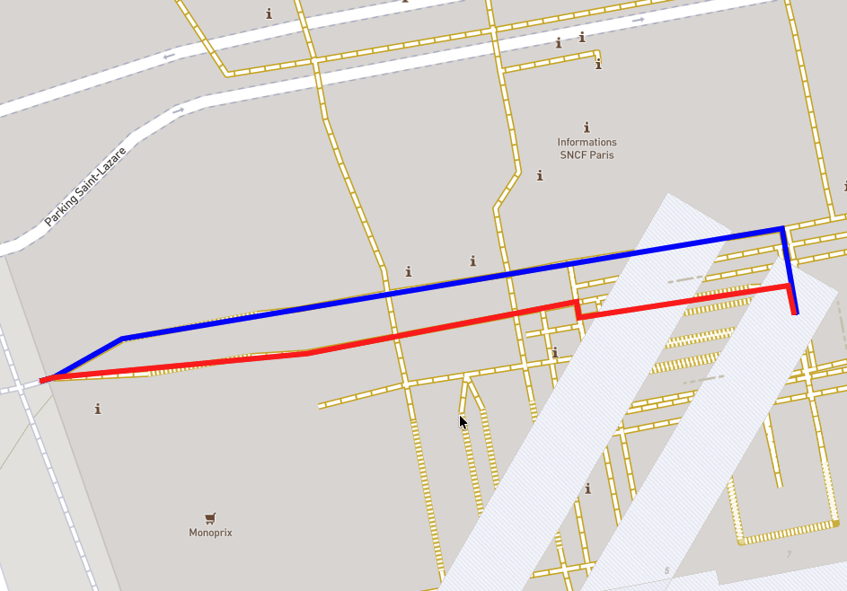

# Level

When routing indoors or in any place with several levels, you can now force a route to start or end at a given level. It also works for any number of waypoints.

A level with the value 'NaN' won't be enforced.

**You must have added the "level" encoded value to your configuration in order for this feature to work.**

Levels are encoded on 11 bit decimals (factor 1), giving values ranging from -40.0 to 164.7.

In practice, the graph's encoded values might sometimes contain "half-floors". E.g. Ways tagged `level=1;2` will have the encoded value `level=1.5` in graphhopper, allowing you to use them in custom models or post-processing.

## API usage

The following examples use data from Paris, France : https://download.geofabrik.de/europe/france/ile-de-france-latest.osm.pbf

### GET Request

Using the `level` query parameter for each point in sequence, notice how we can route to the correct level. We obtained the following image by pasting the route coordinates into a geojson editor.



From level 0 to 1 (in blue): 

`http://localhost:8989/route?point=48.876073,2.323812&point=48.876127,2.324676&level=0&level=1&profile=foot&points_encoded=false`

From level 0 to 0 (in red): 

`http://localhost:8989/route?point=48.876073,2.323812&point=48.876127,2.324676&level=0&level=0&profile=foot&points_encoded=false`

To skip enforcing a level for a specific waypoint, set its level to `NaN` (thereby getting same result as red).

`http://localhost:8989/route?point=48.876073,2.323812&point=48.876127,2.324676&level=NaN&level=0&profile=foot&points_encoded=false`

### POST Request

Use the `levels` array in the JSON payload. Note that coordinates in POST requests are `[longitude, latitude]`:

```json
{
  "points": [
    [2.323812, 48.876073],
    [2.324676, 48.876127]
  ],
  "profile": "foot",
  "levels": [1, 0]
}
```

To leave a waypoint unconstrained, specify `null` or `"NaN"` in the `levels` array:

```json
{
  "points": [
    [2.323812, 48.876073],
    [2.324676, 48.876127]
  ],
  "profile": "foot",
  "levels": [1, null]
}
```