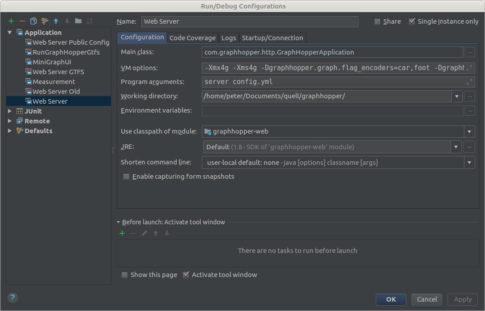

# GraphHopper - Quick Start Guide for Developers

## Try out

For a simpler start consider the pre-built jar and the general [installation documentation](../../README.md)

To build the GraphHopper jar from the Java sources you need to install `git` and [a recent JDK](https://adoptium.net).

Now create the jar from sources via:

```bash
# now get the source code and create the jar in web/target
git clone git://github.com/graphhopper/graphhopper.git
cd graphhopper
git checkout master # if you prefer a less moving branch you can use e.g. 7.x
mvn clean install -DskipTests
# start GraphHopper and before download the road data
wget http://download.geofabrik.de/europe/germany/berlin-latest.osm.pbf
java -Ddw.graphhopper.datareader.file=berlin-latest.osm.pbf -jar web/target/graphhopper-web-*.jar server config-example.yml
# This does the following things:
# - it creates routable files for graphhopper in the folder graph-data (see the config.yml)
# - it creates data for a special routing algorithm to improve query speed. (this and the previous step is skipped, if the graph-data folder is already present)
# - it starts the web service to service the UI and endpoints like /route
# After 'Server - Started' appears go to http://localhost:8989/ and you should see something similar to GraphHopper Maps: https://graphhopper.com/maps/
```

To use a different geographical area make sure you use a different folder instead of graph-data or remove this
and download the appropriate PBF file.

For larger maps you need to add some parameters to the JVM: `java -Xmx10g -Xms10g ...`.
See [the deployment section](deploy.md) for more details.

## Start Development

First you need to run the commands given in section [Try out](#try-out), if you have not done so yet.

Then open the project in your IDE, first class IDEs are NetBeans and IntelliJ where no further setup is required.

### Running & Debbuging with IntelliJ



Go to `Run->Edit Configurations...` and set the following to run GraphHopper from within IntelliJ:
```
Main class: com.graphhopper.application.GraphHopperApplication
VM options: -Xms1g -Xmx1g -server -Ddw.graphhopper.datareader.file=[your-area].osm.pbf -Ddw.graphhopper.graph.location=./[your-area].osm-gh
Program arguments: server config.yml
```

If IntelliJ shows an error like: 
```
Error:(46, 56) java: package sun.misc does not exist
```
go to `Settings -> Build,Execution,Deployment -> Compiler -> Java Compiler` and disable: 
`Use '--release' option for cross compilation (java 9 and later)`. c.f. #1854

### Contribute

See this [guide](../../CONTRIBUTING.md) on how to contribute.

### Java, Embedded Usage

Have a look into the [Java API documentation](../index.md#developer) for further details e.g. how [GraphHopper can
be embedded](./routing.md) into your application and how you create a [custom weighting](./weighting.md).

Look [here](https://github.com/graphhopper/graphhopper#maven) for the maven snippet to use GraphHopper in your
application.

To use an **unreleased** snapshot version of GraphHopper you need the following snippet in your pom.xml
as those versions are not in maven central:

```xml
    <repositories>
        <repository>
            <id>sonatype-oss-public</id>
            <url>https://oss.sonatype.org/content/groups/public/</url>
            <releases>
                <enabled>true</enabled>
            </releases>
            <snapshots>
                <enabled>true</enabled>
            </snapshots>
        </repository>
    </repositories>
```

### Web UI (JavaScript)

The development of the GraphHopper Maps UI happens in a [different repository](https://github.com/graphhopper/graphhopper-maps).
The mvn command will download one of its releases.

### Swing and Desktop Usage

You can use Graphhopper on the Desktop with the help of mapsforge too. No example code is given yet.

For smallish graph (e.g. size of Berlin) use a RAMDataAccess driven GraphStorage (loads all into memory).
For larger ones use the ContractionHierarchies preparation class and MMapDataAccess to avoid OutOfMemoryErrors if you have only few RAM. 
