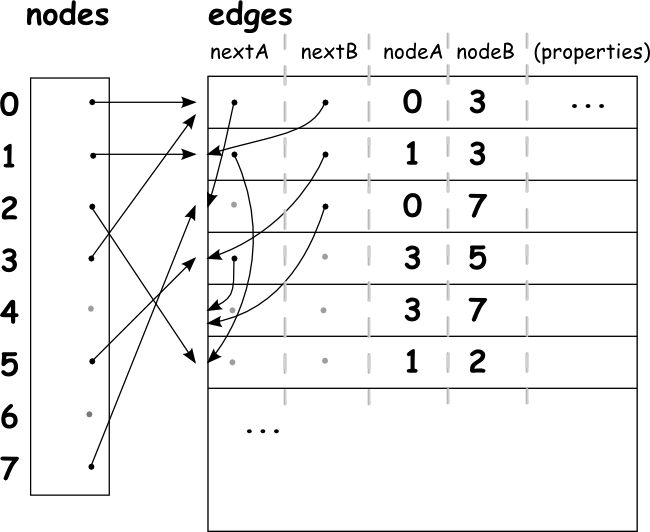

## Technical Overview of GraphHopper

To get a better understanding also take a look in the source code, especially in the unit tests.

There are mainly three parts:

### 1. Data Import

The default import is done via OSMReader which imports OpenStreetMap data. You can change the configuration
in the config.yml to read `car`, `foot` or all vehicles. See the [installation section](../../README.md#installation)
for more details.
The import process is fast e.g. complete Germany takes roughly 10 minutes. Additionally, it will take time if you
enable speed mode by using `profiles_ch` in the config.yml which will dramatically improve query time
but requires more RAM for the import.

### 2. The Graph

To process algorithms you need a _Graph_. At the moment there is one main implementation GraphHopperStorage 
which can be used:

  * in-memory with a safe/flush option (RAMDataAccess) and 
  * a memory mapped (MMapDataAccess).

The interface _Graph_ is developed in the sense that the implementation can be as much efficient as possible
 - i.e. node ids and edge ids are successive (and so are just _indices_) and in the range of 0 to MAX-1. 
This design could be used to have an array-like structure in the underlying DataAccess implementation like 
it is currently the case.

The data layout for the DataAccess objects in GraphHopperStorage called 'nodes' and 'edges' is the following:

Some explanations:
 * One 'node row' consists of latitude,longitude (not shown) and the first edgeID
 * One 'edge row' consists of two edgeIDs: nextA and nextB, then two nodeIDs nodeA and nodeB, and finally some properties like the distance and the flags.
 * One node has several edges which is implemented as a linked list. E.g. node 3 points to its first edge in the edge area at position 0 to edge 0-3 (nodeA-nodeB where nodeA is always smaller than nodeB). To get the next edge of node 3 you need nextB and this goes to edge 1-3, again node 3 is nodeB, but for the next edge 3-5 node 3 is nodeA ... and so on.
 * For you custom data import keep in mind that although the nodes 4 and 6 have no edges they still 'exist' and consume space in the current implementations of DataAccess. For OSMReader this cannot be the case as separate networks with only a small number of nodes are removed (very likely OSM bugs).
 * If CH is enabled the storage adds information for shortcuts, see [this issue](https://github.com/graphhopper/graphhopper/pull/447) for more details.

For some algorithms like Landmarks or Contraction Hierarchies there additional storages necessary and the 'table'
layout is special. Furthermore there is a key value storage to store street
names, conditional tags and more - preferable where the storage size is unknown.

Also there is a version in every data structure which is changed if the 
data structure of GraphHopper gets incompatible to the previous versions.

### 3. The Algorithms

In the routing package you'll find some shortest path algorithms like Dijkstra or A* etc. For those 
algorithms you need a _Graph_.

An algorithm needs the path extraction: from the shortest-path-tree one needs to determine the route 
(list of edges) including the distance and time. Afterwards from this list the exact point (latitude,longitude) 
can be determined. For bidirectional algorithms this is a bit more complicated and done in PathBidirRef. 
For [_Contraction Hierarchies_](http://ad-wiki.informatik.uni-freiburg.de/teaching/EfficientRoutePlanningSS2012)
we use the _RoutingCHGraph_ which additionally holds shortcuts. While path extraction we need to identify those
shortcuts and get the edges recursively, this is done in Path4CH.

## 3.1 Base Graph

In order to traverse the _CHGraph_ like a normal _Graph_ one needs to hide the shortcuts, which
is done automatically for you if you call graph.getBaseGraph(). This is necessary in a 
_LocationIndex_ and in the _Path_ class in order to identify how many streets leave a junction
or similar. See issue [#116](https://github.com/graphhopper/graphhopper/issues/116) for more information.

### 4. Connecting the Real World to the Graph

## 4.1 LocationIndex

In real world we have addresses and/or coordinates for the start and end point. 
To get the coordinate from an address you will need a geocoding solution
which is not part of this GraphHopper routing engine.

To get the closest node or edge id from a coordinate we provide you with an efficient lookup concept:
the LocationIndexTree. See [here](../../example/src/main/java/com/graphhopper/example/LocationIndexExample.java) for more information. See [#17](https://github.com/graphhopper/graphhopper/issues/17) and [#221](https://github.com/graphhopper/graphhopper/issues/221).

## 4.2 QueryGraph

In order to route not only from junctions (which are nodes) we introduced with the _QueryGraph_ in issue #27,
which creates virtual nodes and edges at the query coordinates. It provides a lightweight wrapper around
the _Graph_ and is created per query so that queries do not influence each other.

It can be also introduced for all kinds of dynamically changed nodes and is tested for a few thousand locations.
