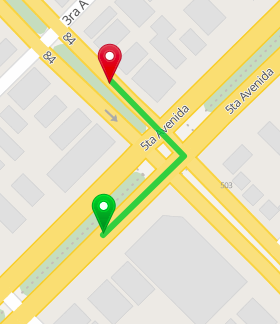
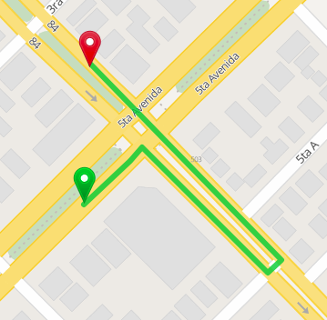

# How to work with Turn Restrictions

GraphHopper supports [turn restrictions](http://wiki.openstreetmap.org/wiki/Relation:restriction).
Currently, it is not possible to use turn restrictions with the 'speed mode' (contraction hierarchies),
but it's possible using the 'hybrid mode' (landmarks) and with the 'flexible mode', 
[see this link for details about the different modes](https://github.com/graphhopper/graphhopper#technical-overview).
Turn restrictions are crucial for correct vehicle navigation and help to avoid forbidden turns.

[Without turn restrictions](https://graphhopper.com/maps/?point=23.1047%2C-82.44319&point=23.10544%2C-82.44316) (the turn is not allowed):

[With turn restrictions](https://graphhopper.com/maps/?point=23.1047%2C-82.44319&point=23.10544%2C-82.44316&ch.disable=true):

Turn restrictions have to be enabled on a vehicle basis. To enable it for one vehicle add
`|turn_costs=true` in the config, for example: `graph.flag_encoders=car|turn_costs=true`.
Turn restrictions are not available for every vehicle as they have low relevance
for some vehicles like `foot`. 
If you enabled the 'speed mode' on import e.g. with `prepare.ch.weightings=fastest` in the configuration, then you'll 
need to disable the 'speed mode' per request by adding `ch.disable=true` as URL parameter.