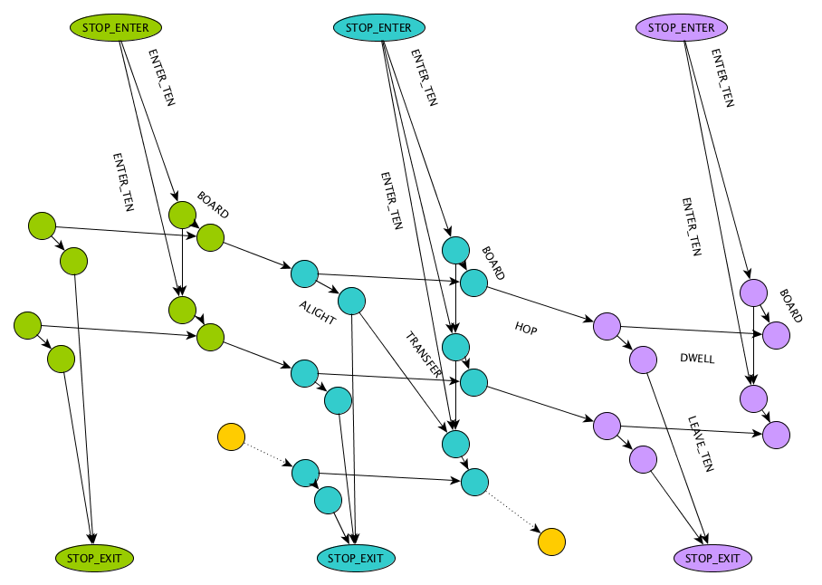

# GraphHopper GTFS

Here is a screenshot of a public transport query. The route with the earliest arrival time is highlighted in green. The three
non-highlighted alternatives have fewer transfers. They include a walk-only route (no vehicle boardings at all).


# Quick Start

```bash
git clone https://github.com/graphhopper/graphhopper
cd graphhopper

# download GTFS from Berlin & Brandenburg in Germany (VBB) and the 'surrounding' OpenStreetMap data for the walk network
wget -O gtfs-vbb.zip https://www.vbb.de/fileadmin/user_upload/VBB/Dokumente/API-Datensaetze/GTFS.zip
wget http://download.geofabrik.de/europe/germany/brandenburg-latest.osm.pbf

mvn clean package -DskipTests

# The following process will take roughly 5 minutes on a modern laptop when it is executed for the first time.
# It imports the previously downloaded OSM data of the Brandenburg area as well as the GTFS.
java -Xmx8g -jar web/target/graphhopper-web-*.jar server reader-gtfs/config-example-pt.yml
```

When this is finished you can point your browser to http://localhost:8989

Alternatively, for a more specialized but more minimal demo of transit routing, to http://localhost:8989/maps/pt/
(make sure to include the trailing slash).

# Visualizing Processed OSM Ways

Requirements: 
- `http-server`: https://www.npmjs.com/package/http-server (installed globally)
- `tippecanoe`: https://github.com/felt/tippecanoe 
- A MapLibre API key (for visualizing maps only)

Run to generate a pmtiles tileset:
```
/graphhopper/logs> $ tippecanoe -z14 -Z8 -l ways_dump -P -o out.pmtiles --drop-fraction-as-needed ways_dump.ldgeojson
```
- Add a your MapLibre API key to `readger-gtfs/index.html`

Run to serve viz page:
```
/graphhopper/reader-gtfs> $ http-server --cors
```

# Graph schema



We see three trips of two routes (top to bottom: route 1, route 1, route 2) and three stations (colored groups).
The ENTER_TEN and LEAVE_TEN edges are the entry and exit to the time expanded network proper. They enforce that
you are put on the correct node in the timeline when searching forward and backward, respectively. The STOP_ENTER
and STOP_EXIT nodes are regular, spatial nodes which can be connected to the road network.

The BOARD edge checks if the trip is valid on the requested day: Our graph is "modulo operating day", but
a pure time expanded graph which is fully unrolled is also possible. Then that check could go away. It also
counts the number of boardings.

The TRANSFER edge ensures that the third departure is only reachable from the first arrival but not from the second one.
